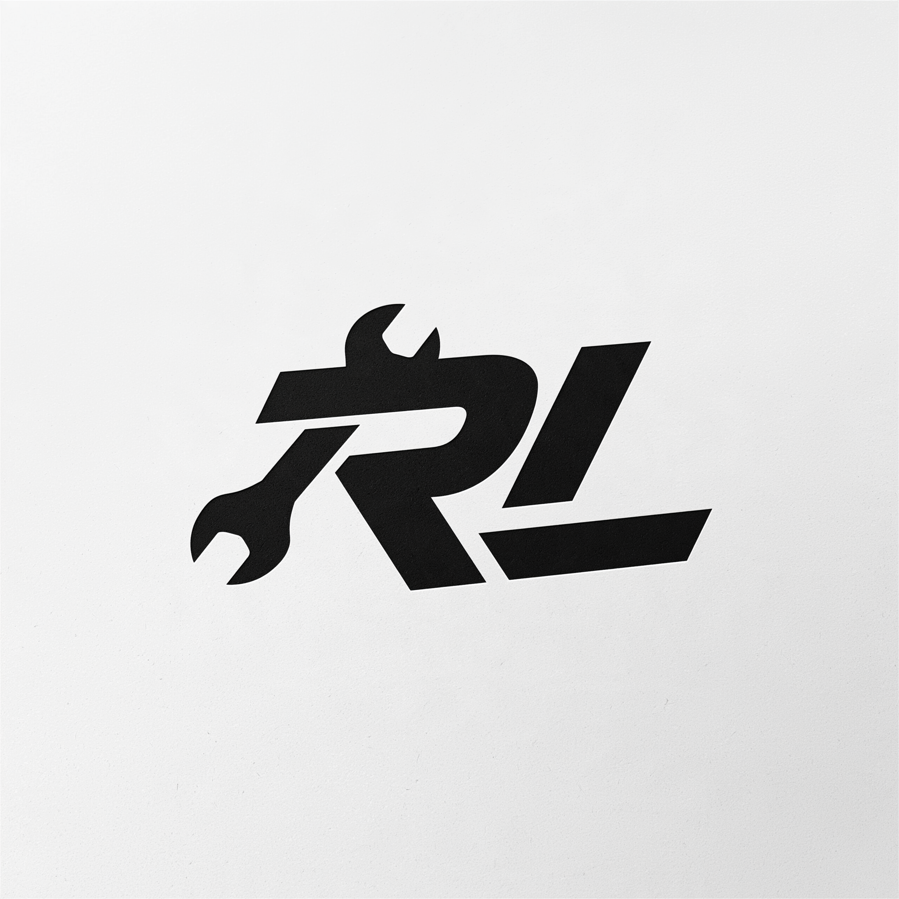

<div align="center">
  
  <h1>Riot Loader</h1>
  <p><b>⚡ The native League of Legends client companion platform & loader</b></p>
  <p>
    A high-performance Win32 loader and companion platform featuring native constructable theming, runtime extensions, and a built-in Vue 3 companion experience.
  </p>
  <p>
    <a href="https://github.com/garc-kt/riot-launcher/releases/latest">
      
    </a>
    <a href="LICENSE">
      
    </a>
    <a href="https://github.com/sponsors/garc-kt">
      
    </a>
    <a href="https://ko-fi.com/garckt">
      
    </a>
  </p>
</div>

---

## 📌 Upstream Attribution & Fork Statement

**Riot Loader** is an enhanced, Win32-dedicated fork of [**Pengu Loader**](https://github.com/PenguLoader/PenguLoader) (`Copyright (c) 2024 Pengu Loader`, licensed under the **MIT License**).

Upstream Pengu Loader established the foundation for injecting JavaScript into the League of Legends client shell. **Riot Loader** diverges into an integrated companion ecosystem—rebuilding the preload engine with native constructable theming, embedding a first-party Vue 3 companion application, enforcing match safety rules, and providing backward-compatible additive extensions.

---

## ✨ Key Features & Architecture

### 1. Built-in First-Party Companion (`app/`)
- **Modern Reactive Stack**: Vue 3 (Composition API), Vite, Pinia, `@pinia/colada`, and Tailwind CSS.
- **Runtime Validation**: All LCU and SGP payloads are parsed through Zod schemas to safeguard against Riot patch changes.
- **Match Safety Posture (§0 & §4.5)**: Automatically unmounts DOM and suspends all network polling when game phase enters `InProgress`.
- **Emergency Kill-Switch**: Global panic hotkey (`Ctrl+Shift+Alt+K`) to immediately and permanently deactivate the companion.

### 2. Native Constructable Theming Engine (§7)
- **Zero Flash-of-Unstyled-Content (FOUC)**: Installed in preload before client Web Components instantiate.
- **Shadow DOM Penetration**: Uses shared constructable stylesheets adopted by every shadow root as it is created.
- **Iframe Synchronization**: Listens for dynamic iframes via `MutationObserver` and injects isolated styles.
- **Rule Extraction**: Automatically splits `@import` and `@font-face` rules into document-level head styles to avoid CEF constructable stylesheet quirks.

### 3. Additive Runtime Extensions (`context.ext`)
Maintains 100% backward compatibility with existing upstream plugins (`rcp`, `socket`, `meta`, and `window.DataStore`), while introducing modern APIs:
- `context.ext.store`: Scoped, non-blocking per-plugin key-value storage.
- `context.ext.fs`: Scoped filesystem virtual read/write access.
- `context.ext.commands`: Command palette registration bridge.
- `context.ext.theme`: Programmatic theme control API.

### 4. Upstream Coexistence Protection (§9.1)
- Built-in detection in both Rust and TypeScript checking for active PenguLoader installations, IFEO debuggers, or conflicting proxy DLLs.
- Refuses to install over existing loaders to prevent half-broken client states.

### 5. Streamlined Win32 Architecture
- **Windows-Only Focus**: Removed dead macOS branches, Objective-C++ sources (`cocoa.mm`), and conditional compiler overhead.
- **Modern WebView2 Detection**: Native support for modern Edge WebView2 Evergreen runtimes (`msedgewebview2.exe`).

---

## 📦 Project Structure

```
riot-loader/
├── app/                  # Injected Vue 3 companion application
├── core/                 # Win32 C++20 CEF hook & proxy injector (outputs core.dll)
├── loader/               # Tauri desktop launcher application
├── plugins/              # Preload runtime bundle & theming engine (outputs preload.js & preload.g.h)
├── tests/                # Automated unit test suites
└── .github/workflows/    # Continuous Integration & release pipeline
```

---

## 🛠️ Development & Building

The repository is organized as a unified **pnpm workspace monorepo**.

### Prerequisites
- **Node.js** >= 20 (Node 22 recommended)
- **pnpm** >= 9
- **Visual Studio Build Tools 2022** (with C++ Desktop workload) — *for building `core.dll`*
- **Rust** (stable) — *for building the Tauri desktop launcher*

### Quick Commands

```bash
# 1. Install all dependencies across workspaces
pnpm install

# 2. Run the unit test suite (coexistence, schemas, passive mode, theming, extensions)
pnpm test

# 3. Typecheck all packages
pnpm run typecheck

# 4. Build all frontend packages (preload, loader UI, companion app)
pnpm run build

# 5. Start development servers
pnpm run dev:app       # Companion app Vite dev server
pnpm run dev:loader    # Desktop launcher Vite dev server
pnpm run dev:plugins   # Preload bundle Vite dev server
```

---

## 💖 Sponsoring & Support

If you find Riot Loader useful and want to support continued development and maintenance:

- **GitHub Sponsors**: [github.com/sponsors/garc-kt](https://github.com/sponsors/garc-kt)
- **Ko-fi**: [ko-fi.com/garckt](https://ko-fi.com/garckt)

Your support helps keep the project open-source, maintained against League client patches, and continuously improving!

---

## 📄 License & Attribution

This project is licensed under the **MIT License**.

- Upstream code: `Copyright (c) 2024 Pengu Loader`
- Additions & modifications: `Copyright (c) 2026 Riot Loader contributors`

See the [`LICENSE`](LICENSE) file for the full license text.

---

## ⚠️ Disclaimer

Riot Loader is not affiliated with, endorsed, or sponsored by Riot Games, Inc. League of Legends and Riot Games are trademarks or registered trademarks of Riot Games, Inc. Use of client modifications is subject to Riot Games' Terms of Service.
